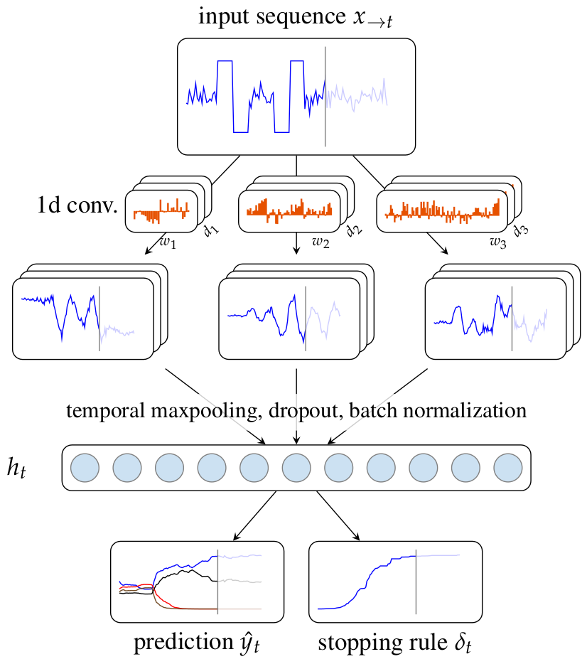

End-to-end Learning for Early Classification of Time Series (ELECTS)
===

### Paper

https://arxiv.org/abs/1901.10681



### Doc repositories

for paper see https://github.com/MarcCoru/ICML19

for presentation see github.com/MarcCoru/early_classification.git

### Download data

```angular2
wget https://s3.eu-central-1.amazonaws.com/corupublic/early_rnn.zip
```