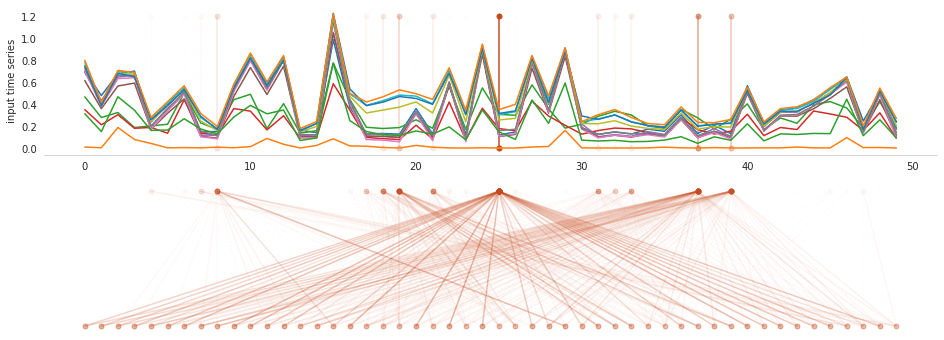
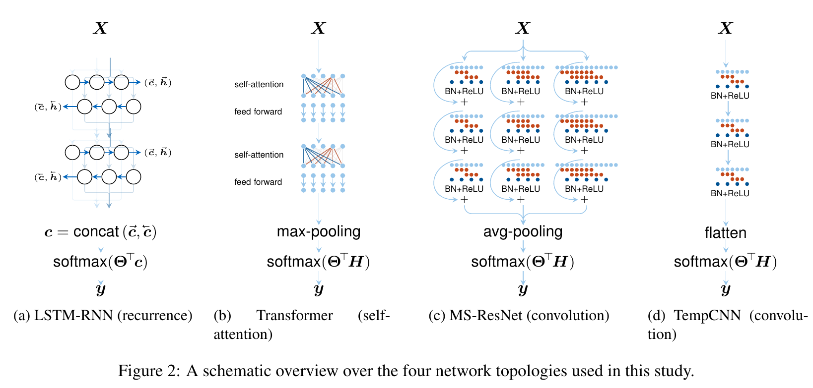

# Self-Attention for Raw Optical Satellite Time Series Classification

<!--
```bibtex
@article{russwurm2019self,
  title={Self-Attention for Raw Optical Satellite Time Series Classification},
  author={Ru{\ss}wurm, Marc and K{\"o}rner, Marco},
  journal={arXiv preprint arXiv:1910.10536},
  year={2019}
}
```
-->

Feature extraction through self-attention on Raw Sentinel 2 Time Series


Source Code of 
[Rußwurm & Körner (2019), *Self-Attention for Raw Optical Satellite Time Series Classification*](https://arxiv.org/abs/1910.10536)


```bibtex
@article{russwurm2019self,
  title={Self-Attention for Raw Optical Satellite Time Series Classification},
  author={Ru{\ss}wurm, Marc and K{\"o}rner, Marco},
  year={2019}
}
```


## Architectures



Four deep learning models for time series classification are implemented

* Recurrent Neural Net (LSTM) `src/models/rnn.py`
* Transformer `src/models/transformerEncoder.py`
* TempCNN (Pelleter et al., 2019) `src/models/tempcnn.py`
* Multi-scale ResNet `src/models/msresnet.py`

## Getting started


### Python Dependencies

Anaconda environment
```
conda create -n crop-type-mapping python=3.7.3 pip
conda activate crop-type-mapping
pip install -r requirements.txt
```

<!--
Build docker container
```
docker build -t croptypemapping . 
```
-->

### Download Dataset, Tuning Results and Models

download raw Sentinel 2 crop type label dataset to `data/BavarianCrops` via
```bash
bash download.sh dataset 
```
and the pretrained models for hyperparameter tuning and evaluation via
```bash
bash download.sh models 
```
or both with `bash download.sh all`

Experiments are composed of a set of parameters that define model and datasets. Experiments are defined in the `if-else` cases
in `src/experiments.py` and generally follow the naming convention `isprs_<model>_<dataset>_<meta>`.

### Training

start visdom server by running `visdom` in conda environment and open `http://localhost:8097/` in the browser.

train from scratch (23 classes) with hyperparameters defined in `../models/tune/23classes/transformer_tum.csv`.
Working directory is `src`
```bash
python train.py --experiment isprs_tum_transformer \\
    --store /tmp/
    --classmapping ../data/BavarianCrops/classmapping23.csv \\
    --hyperparameterfolder ../models/tune/23classes
```

to continue training with 23 classes point `--store` to an existing model
```bash
python train.py --experiment isprs_tum_transformer \\
    --store ../models/train/23classes/0
    --classmapping ../data/BavarianCrops/classmapping23.csv \\
    --hyperparameterfolder ../models/tune/23classes
```

experiments on raw dataset: `isprs_tum_transformer`, `isprs_tum_msresnet`, `isprs_tum_tempcnn`, `isprs_tum_rnn`

classmappings: mapping tables to select 12 or 23 classes to classify

hyperparameter folder: folder with results of ray-tune results implemented in `tune.py`. hyperparameters summarized in csv files for model and dataset, as defined in `src/hyperparameters.py`

### Hyperparameter Tuning

[Ray-Tune](https://ray.readthedocs.io/en/latest/tune.html) allows hyperparameter tuning of multiple models in parallel.
Execute in `src`
```bash
python tune.py --experiment transformer_tum \\
    -g 0.5 -c 2 -b 64 --local_dir ../models/tune --seed 0 \\
    --classmapping $PWD/../data/BavarianCrops/classmapping23.csv \\
    --dataroot $PWD/../data
```
to train two models per GPU and store results in `../models/tune`.
Valid experiments are `[transformer|rnn|msresnet|tempcnn]_[tum|gaf]` which are defined in `src/hyperparameter.py`

## External Code

* Self-Attention implementation by [Yu-Hsiang Huang](https://github.com/jadore801120)

https://github.com/jadore801120/attention-is-all-you-need-pytorch

* Multi-scale ResNet implementation by [Fei Wang](https://github.com/geekfeiw)

https://github.com/geekfeiw/Multi-Scale-1D-ResNet

* Original Tensorflow TempCNN implementation by [Charlotte Pelletier](https://github.com/charlotte-pel)

https://github.com/charlotte-pel/igarss2019-dl4sits

